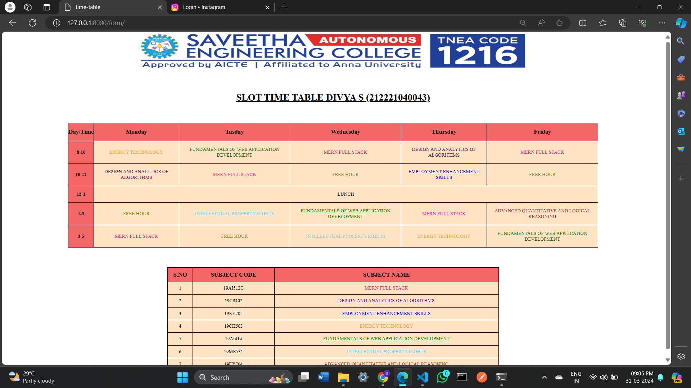

# Ex03 Time Table
## Date:31-03-2024

## AIM
To write a html webpage page to display your slot timetable.

## ALGORITHM
### STEP 1
Create a Django-admin Interface.

### STEP 2
Create a static folder and inert HTML code.

### STEP 3
Create a simple table using ```<table>``` tag in html.

### STEP 4
Add header row using ```<th>``` tag.

### STEP 5
Add your timetable using ```<td>``` tag.

### STEP 6
Execute the program using runserver command.

## PROGRAM
```
<!DOCTYPE html>
<html lang="en">
<head>
    <meta charset="UTF-8">
    <meta name="viewport" content="width=device-width, initial-scale=1.0">
    <title>time-table</title>
    <STYLE>
            body {
            margin: 0;
        }
        .slot-time{
            border-collapse: collapse;
            align-items: center;
            text-align: center;
            margin-left: 10%;
            margin-top: 3%;
            width:80%;
        }
        .subject-time{
            border-collapse: collapse;
            align-items: center;
            text-align: center;
            margin-left: 25%;
            margin-top: 3%;
            width:50%;
        }
        td,th{
            padding: 1%;
        }
        th{
        font-weight: bolder;
        font-size: 20px;
        }
        .slot{
            font-weight: bolder;
        }
        
    </STYLE>
    
</head>
<body>
    
    <h1 style="text-align:center;margin-top:3%;"><u>SLOT TIME TABLE DIVYA S (212221040043)</u></h1>
    <table border="1" class="slot-time">
        <thead>
        <tr>
            <th style="padding:0%;">Day/Time</th>
            <th>Monday</th>
            <th>Tusday</th>
            <th>Wednesday</th>
            <th>Thursday</th>
            <th>Friday</th>
        </tr>
    </thead>
    <tbody>
        <tr>
<td class="slot">8-10</td>
<td style="color:orange">ENERGY TECHNOLOGY</td>
<td style="color:green">FUNDAMENTALS OF WEB APPLICATION DEVELOPMENT</td>
<td style="color:deeppink">MERN FULL STACK</td>
<td style="color:purple">DESIGN AND ANALYTICS OF ALGORITHMS</td>
<td style="color:deeppink">MERN FULL STACK</td>
</tr>
<tr>
    <td class="slot">10-12</td>
<td style="color:purple">DESIGN AND ANALYTICS OF ALGORITHMS</td>
<td style="color:deeppink">MERN FULL STACK</td>
<td style="color:olive">FREE HOUR</td>
<td style="color:blue">EMPLOYMENT ENHANCEMENT SKILLS</td>
<td style="color:olive">FREE HOUR</td>
</tr>
<tr>
    <td class="slot">1-3</td>
    <td style="color:olive">FREE HOUR</td>
    <td style="color:skyblue">INTELLECTUAL PROPERTY RIGHTS</td>
    <td  style="color:green">FUNDAMENTALS OF WEB APPLICATION DEVELOPMENT</td>
    <td style="color:deeppink">MERN FULL STACK</td>
    <td style="color:brown">ADVANCED QUANTITATIVE AND LOGICAL REASONING</td>
</tr>
<tr>
    <td class="slot">3-5</td>
    <td style="color:deeppink">MERN FULL STACK</td>
    <td style="color:olive">FREE HOUR</td>
    <td style="color:skyblue">INTELLECTUAL PROPERTY RIGHTS</td>
    <td style="color:orange">ENERGY TECHNOLOGY</td>
    <td  style="color:green">FUNDAMENTALS OF WEB APPLICATION DEVELOPMENT</td>
</tr>
        </tbody>
    </table>
    <table border="1" class="subject-time">
        <thead>
            <tr>
                <th>S.NO</th>
                <th>SUBJECT CODE</th>
                <th>SUBJECT NAME</th>
            </tr>
        </thead>
        <TBODY>
            <tr>
                <td>1</td>
                <td>19AI512C</td>
                <td style="color:deeppink" >MERN FULL STACK</td>
            </tr>
            <tr>
                <td>2</td>
                <td>19CS402</td>
                <td  style="color:purple">DESIGN AND ANALYTICS OF ALGORITHMS</td>
            </tr>
            <tr>
                <td>3</td>
                <td>19EY705</td>
                <td style="color:blue">EMPLOYMENT ENHANCEMENT SKILLS</td>
            </tr>
            <tr>
                <td>4</td>
                <td>19CH503</td>
                <td  style="color:orange">ENERGY TECHNOLOGY</td>
            </tr>
            <tr>
                <td>5</td>
                <td>19AI414 </td>
                <td style="color:green">FUNDAMENTALS OF WEB APPLICATION DEVELOPMENT</td>
            </tr>
            <tr>
                <td>6</td>
                <td>19ME531 </td>
                <td style="color:skyblue">INTELLECTUAL PROPERTY RIGHTS</td>
            </tr>
            <tr>
                <td>7</td>
                <td>19EY704</td>
                <td style="color:brown">ADVANCED QUANTITATIVE AND LOGICAL REASONING</td>
            </tr>
        </tbody>
    </table>
</body>
</html>
```
## OUTPUT


## RESULT
The program for creating slot timetable using basic HTML tags is executed successfully.
